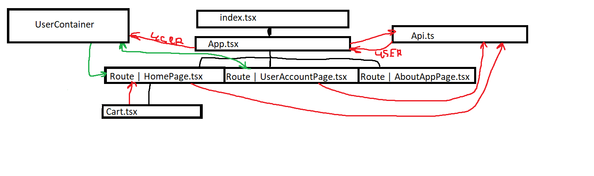

# Коротко о том как оно вообще работает

*Черные стрелки - это, грубо говоря, родитель -> ребёнок*

*Красные стрелки - это то куда делается запрос из разряда "дай мне вот это", у `App.tsx` ещё есть стрелка с 'user' - это значит она через `Api.ts` получает данные пользователя, потом их записывает в `UserContainer`*

*Зеленые стрелки - это значит, что вот сюда -> вот сюда берутся данные, но не через АПИ как в случае красных стрелок, а как просто из переменной*

# `index.tsx`

Это главный файл или же просто "точка входа в программу", тут идёт привязка всего приложения к элементу с id `root`. Также инициализируется `BrowserRouter` необходимый для маршрутизации.

# `Api.ts`

Файл с описаным базовым классом `BaseApi`, выполняющий запрос по необходимому URL.
Также реализованы классы наследники от базового, каждый из которых предназначен для получения/изменения данных сугубо в их "области полномочий" `MainApi` для получениях общедоступных данных, `UserApi` - данные связанные с пользователем (личные данные, корзина и тд)

# `App.tsx`

Этот модуль притягивает к `index.tsx` в нём по сути располагается наша логика приложения. В нём происходит:

- Создание интервала для получения данных пользователя каждые 5 секунд
- Контейнера с данными пользователя
- Инициализация возможных маршрутов с помощью `react-router`

Обо всём по порядку

1) Интервал вызывает функцию, которая создаёт экземпляр класса UserApi и выполняет получение данных пользователя с последующей записью в контейнер `UserContainer`.

2) Контейнер `UserContainer` - глобальное хранилище доступное из любой точки программы, служит для более простого взаимодействия внутри прочих компонент с данными пользователя (в большистве случаев выяснить как минимум аноним или авторизированный пользователь)

3) С помощью `react-router` инициализиурем маршруты:

    ### Главная страцица (`HomePage.tsx` [на самом деле там `index.tsx`, просто для простоты обозначения написал так, но по сути там `./HomePage/index.tsx`])
    - /
    ### Личный кабинет (`UserAccountPage.tsx`)
    - /lk
    ### Страница "О сервисе" (`AboutAppPage.tsx`)
    - /about-app
    ### Страница 404 (`NotFound.tsx`)
    - /*          

За счёт данной инициализации при переходе на соответствующие URL (к примеру `https:\\domain\lk`) React будет понимать что именно нужно отображать и какие скрипты запускать

# `HomePage.tsx`

Главная страница - она получает данные о пользовател из контейнера и отдаёт эти данные `Cart`, а также сама следит за этим, потому что в случае, если пользователь авторизован, то становится доступен некоторый функционал.

Также она получает данные о товарах, категориях и прочем, для дальнейшего отображения их. 

# `UserAccountPage.tsx`

Предназначено для:

- Взаимодействия пользователя со своими личными данными
- Оформлением / изменением / отменой заказа

Также получает данные о пользователе из `UserContainer`

# `AboutAppPage.tsx`

*Тут опиши сам это как раз та страница "о сервисе", которую ты сам хотел сделать*

# `Cart.tsx`

Корзина пользователя на главной странице. Это один из компонентов, которые чуть более необычно взаимодействуют со всем остальным. Он используется внутри `HomePage` и только в случае, если в `UserContainer` данные есть, в противном случае она банально не будет отображаться и логика внутри также ограничена.

Также в случае каких-то изменений в корзине, то через компоненту `HomePage` идёт взаимодействие с АПИ.

# Прочие компоненты

Имеется ввиду некоторые другие компоненты, которые не обозначены здесь, но также используются в приложении. Они просто нужны для инкапсуляции отдельных участков вёрстки или небольшой логики. Ну и также уменьшают объём кода в одном файле.